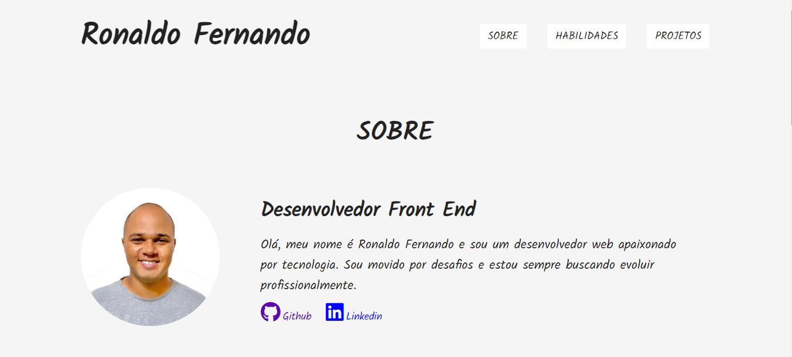

# portfolio

Link da página: <https://ronaldof16.github.io/portfolio/>

## Sobre

Esse projeto foi criado para que eu possa me apresentar, falar sobre minhas habilidades e mostrar os principais projetos
que já consegui desenvolver. Foi feito apenas com html e css mas pretendo aprfeiçoá-lo com o uso de outras tecnologias na 
medida que eu for evoluindo nos estudos e adquirindo novos conhecimentos. 

## Competências utilizadas

* HTML
* CSS
